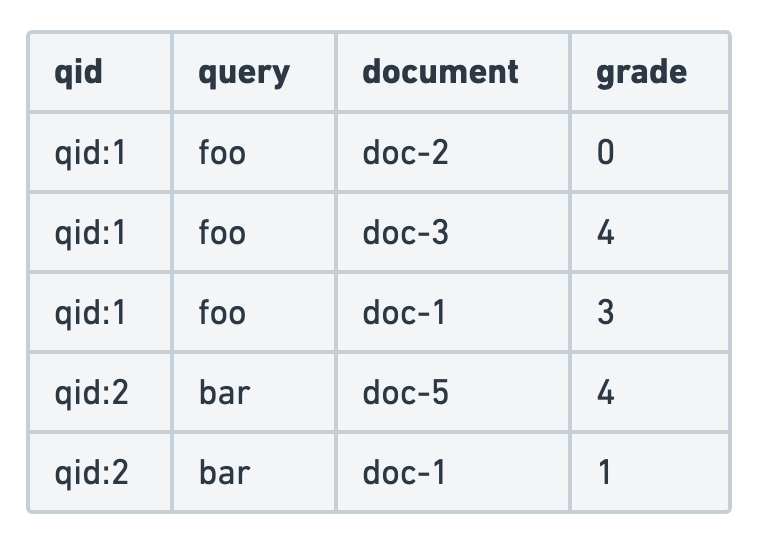
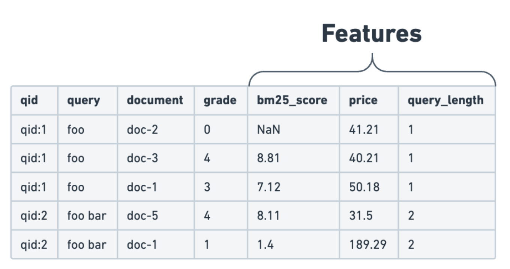

# Learn To Rank

## What it does

Learning To Rank (LTR) uses a trained machine learning (ML) model to build a ranking function for your search engine. Typically, the model is used as a second stage re-ranker, to improve the relevance of search results returned by a simpler, first stage retrieval algorithm. The LTR function takes a list of documents and a search context and outputs ranked documents


## Search contextedit

In addition to the list of documents to sort, the LTR function also requires a search context. Typically, this search context includes at least the search terms provided by the user (text_query in the example above). The search context can also provide additional information used in the ranking mode. This could be information about the user doing the search (such as demographic data, geolocation, or age); about the query (such as query length); or document in the context of the query (such as score for the title field).

## Judgment listedit

The LTR model is usually trained on a judgment list, which is a set of queries and documents with a relevance grade. Judgment lists can be human or machine generated: they’re commonly populated from behavioural analytics, often with human moderation. Judgment lists determine the ideal ordering of results for a given search query. The goal of LTR is to fit the model to the judgment list rankings as closely as possible for new queries and documents.

The judgment list is the main input used to train the model. It consists of a dataset that contains pairs of queries and documents, along with their corresponding relevance labels. The relevance judgment is typically either a binary (relevant/irrelevant) or a more granular label, such as a grade between 0 (completely irrelevant) to 4 (highly relevant). The example below uses a graded relevance judgment.



## Notes on judgment lists

While a judgment list can be created manually by humans, there are techniques available to leverage user engagement data, such as clicks or conversions, to construct judgment lists automatically.

The quantity and the quality of your judgment list will greatly influence the overall performance of the LTR model. The following aspects should be considered very carefully when building your judgment list:

- Most search engines can be searched using different query types. For example, in a movie search engine, users search by title but also by actor or director. It’s essential to maintain a balanced number of examples for each query type in your judgment list. This prevents overfitting and allows the model to generalize effectively across all query types.
- Users often provide more positive examples than negative ones. By balancing the number of positive and negative examples, you help the model learn to distinguish between relevant and irrelevant content more accurately.

## Feature extraction

Query and document pairs alone don’t provide enough information to train the ML models used for LTR. The relevance scores in judgment lists depend on a number of properties or features. These features must be extracted to determine how the various components combine to determine document relevance. The judgment list plus the extracted features make up the training dataset for an LTR model.

These features fall into one of three main categories:

- **Document features**: These features are derived directly from document properties. Example: product price in an eCommerce store.
- **Query features**: These features are computed directly from the query submitted by the user. Example: the number of words in the query.
- **Query-document features**: Features used to provide information about the document in the context of the query. Example: the BM25 score for the title field.
  To prepare the dataset for training, the features are added to the judgment list:



To do this in Elasticsearch, use templated queries to extract features when building the training dataset and during inference at query time. Here is an example of a templated query:

```json
[
  {
    "query_extractor": {
      "feature_name": "title_bm25",
      "query": { "match": { "title": "{{query}}" } }
    }
  }
]
```

## Models

The heart of LTR is of course an ML model. The model relies solely on the features and relevance labels from the training data.

The LTR space is evolving rapidly and many approaches and model types are being experimented with. In practice Elasticsearch relies specifically on gradient boosted decision tree [(GBDT)](https://en.wikipedia.org/wiki/Gradient_boosting#Gradient_tree_boosting) models for LTR inference.

Note that Elasticsearch supports model inference but the training process itself must happen outside of Elasticsearch, using a GBDT model. Among the most popular LTR models used today, [LambdaMART](https://www.microsoft.com/en-us/research/wp-content/uploads/2016/02/MSR-TR-2010-82.pdf) provides strong ranking performance with low inference latencies. It relies on GBDT models and is therefore a perfect fit for LTR in Elasticsearch.

## Learning how to make a custom model

[Link to jupyter notebook containing instuctions](https://github.com/elastic/elasticsearch-labs/blob/main/notebooks/search/08-learning-to-rank.ipynb)
