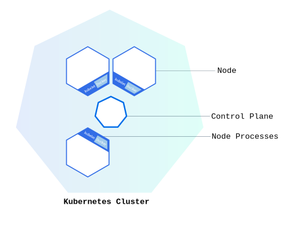

# Learn Kubernetes Basics

## Kubernetes Clusters

Kubernetes coordinates a highly available cluster of computers that are connected to work as a single unit.

A Kubernetes cluster consists of two types of resources:

- The Control Plane coordinates the cluster
- Nodes are the workers that run applications

### Cluster Diagram



**The Control Plane is responsible for managing the cluster**. The Control Plane coordinates all activities in your cluster, such as scheduling applications, maintaining applications' desired state, scaling applications, and rolling out new updates.

**A node is a VM or a physical computer that serves as a worker machine in a Kubernetes cluster**. Each node has a Kubelet, which is an agent for managing the node and communicating with the Kubernetes control plane. The node should also have tools for handling container operations, such as **containerd** or **CRI-O**. A Kubernetes cluster that handles production traffic should have a minimum of three nodes because if one node goes down, both an etcd member and a control plane instance are lost, and redundancy is compromised. You can mitigate this risk by adding more control plane nodes.

When you deploy applications on Kubernetes, you tell the control plane to start the application containers. The control plane schedules the containers to run on the cluster's nodes. **Node-level components, such as the kubelet, communicate with the control plane using the Kubernetes API**, which the control plane exposes. End users can also use the Kubernetes API directly to interact with the cluster.

A Kubernetes cluster can be deployed on either physical or virtual machines. To get started with Kubernetes development, you can use Minikube. Minikube is a lightweight Kubernetes implementation that creates a VM on your local machine and deploys a simple cluster containing only one node.

## Using kubectl to Create a Deployment

Once you have a running Kubernetes cluster, you can deploy your containerized applications on top of it. To do so, you create a Kubernetes Deployment. The Deployment instructs Kubernetes how to create and update instances of your application. Once you've created a Deployment, the Kubernetes control plane schedules the application instances included in that Deployment to run on individual Nodes in the cluster.

Once the application instances are created, a Kubernetes Deployment controller continuously monitors those instances. If the Node hosting an instance goes down or is deleted, the Deployment controller replaces the instance with an instance on another Node in the cluster. This provides a self-healing mechanism to address machine failure or maintenance.

In a pre-orchestration world, installation scripts would often be used to start applications, but they did not allow recovery from machine failure. By both creating your application instances and keeping them running across Nodes, Kubernetes Deployments provide a fundamentally different approach to application management.

### Deploying your first app on Kubernetes


You can create and manage a Deployment by using the Kubernetes command line interface, **kubectl**. Kubectl uses the Kubernetes API to interact with the cluster.

When you create a Deployment, you'll need to specify the container image for your application and the number of replicas that you want to run. You can change that information later by updating your Deployment.

### kubectl basics

The common format of a kubectl command is: `kubectl action resource`

This performs the specified action (like **create**, **describe** or **delete**) on the specified resource (like **node** or **deployment**). You can use `--help` after the subcommand to get additional info about possible parameters (for example: `kubectl get nodes --help`).

Check that kubectl is configured to talk to your cluster, by running the `kubectl version` command.

Check that kubectl is installed and you can see both the client and the server versions.

To view the nodes in the cluster, run the `kubectl get nodes` command.

You see the available nodes. Later, Kubernetes will choose where to deploy our application based on Node available resources.

### Deploy an app

Let’s deploy our first app on Kubernetes with the `kubectl create deployment` command. We need to provide the deployment name and app image location (include the full repository url for images hosted outside Docker Hub).

`kubectl create deployment kubernetes-bootcamp --image=gcr.io/google-samples/kubernetes-bootcamp:v1`

Great! You just deployed your first application by creating a deployment. This performed a few things for you:

- searched for a suitable node where an instance of the application could be run (we have only 1 available node)
- scheduled the application to run on that Node
- configured the cluster to reschedule the instance on a new Node when needed

To list your deployments use the `kubectl get deployments` command:

`kubectl get deployments`

We see that there is 1 deployment running a single instance of your app. The instance is running inside a container on your node.

### View the app

Pods that are running inside Kubernetes are running on a private, isolated network. By default they are visible from other pods and services within the same Kubernetes cluster, but not outside that network. When we use `kubectl`, we're interacting through an API endpoint to communicate with our application.

The `kubectl proxy` command can create a proxy that will forward communications into the cluster-wide, private network. The proxy can be terminated by pressing control-C and won't show any output while it's running.

**You need to open a second terminal window to run the proxy.**

`kubectl proxy`

We now have a connection between our host (the terminal) and the Kubernetes cluster. The proxy enables direct access to the API from these terminals.

You can see all those APIs hosted through the proxy endpoint. For example, we can query the version directly through the API using the `curl` command:

`curl http://localhost:8001/version`

The API server will automatically create an endpoint for each pod, based on the pod name, that is also accessible through the proxy.

First we need to get the Pod name, and we'll store it in the environment variable **POD_NAME**:

`export POD_NAME=$(kubectl get pods -o go-template --template '{{range .items}}{{.metadata.name}}{{"\n"}}{{end}}')`

`echo Name of the Pod: $POD_NAME`

You can access the Pod through the proxied API, by running:

`curl http://localhost:8001/api/v1/namespaces/default/pods/$POD_NAME:8080/proxy/`

## Kubernetes Pods

When you created a Deployment, Kubernetes created a Pod to host your application instance. A Pod is a Kubernetes abstraction that represents a group of one or more application containers (such as Docker), and some shared resources for those containers. Those resources include:

- Shared storage, as Volumes
- Networking, as a unique cluster IP address
- Information about how to run each container, such as the container image version or specific ports to use

A Pod models an application-specific "logical host" and can contain different application containers which are relatively tightly coupled. For example, a Pod might include both the container with your Node.js app as well as a different container that feeds the data to be published by the Node.js webserver. The containers in a Pod share an IP Address and port space, are always co-located and co-scheduled, and run in a shared context on the same Node.

Pods are the atomic unit on the Kubernetes platform. When we create a Deployment on Kubernetes, that Deployment creates Pods with containers inside them (as opposed to creating containers directly). Each Pod is tied to the Node where it is scheduled, and remains there until termination (according to restart policy) or deletion. In case of a Node failure, identical Pods are scheduled on other available Nodes in the cluster.

### Pods overview


### Nodes

A Pod always runs on a **Node**. A Node is a worker machine in Kubernetes and may be either a virtual or a physical machine, depending on the cluster. Each Node is managed by the control plane. A Node can have multiple pods, and the Kubernetes control plane automatically handles scheduling the pods across the Nodes in the cluster. The control plane's automatic scheduling takes into account the available resources on each Node.

Every Kubernetes Node runs at least:

- Kubelet, a process responsible for communication between the Kubernetes control plane and the Node; it manages the Pods and the containers running on a machine.
- A container runtime (like Docker) responsible for pulling the container image from a registry, unpacking the container, and running the application.

### Node overview


### Troubleshooting with kubectl

The most common operations can be done with the following kubectl subcommands:

- **kubectl get** - list resources
- **kubectl describe** - show detailed information about a resource
- **kubectl logs** - print the logs from a container in a pod
- **kubectl exec** - execute a command on a container in a pod

You can use these commands to see when applications were deployed, what their current statuses are, where they are running and what their configurations are.

### Check application configuration

Let's verify that the application we deployed in the previous scenario is running. We'll use the `kubectl get` command and look for existing Pods:

`kubectl get pods`

If no pods are running, please wait a couple of seconds and list the Pods again. You can continue once you see one Pod running.

Next, to view what containers are inside that Pod and what images are used to build those containers we run the `kubectl describe pods` command:

`kubectl describe pods`

We see here details about the Pod’s container: IP address, the ports used and a list of events related to the lifecycle of the Pod.

### Show the app in the terminal

Recall that Pods are running in an isolated, private network - so we need to proxy access to them so we can debug and interact with them. To do this, we'll use the `kubectl proxy` command to run a proxy in a **second terminal**. Open a new terminal window, and in that new terminal, run:

`kubectl proxy`

Now again, we'll get the Pod name and query that pod directly through the proxy. To get the Pod name and store it in the POD_NAME environment variable:

`export POD_NAME="$(kubectl get pods -o go-template --template '{{range .items}}{{.metadata.name}}{{"\n"}}{{end}}')"`

`echo Name of the Pod: $POD_NAME`

To see the output of our application, run a curl request:

`curl http://localhost:8001/api/v1/namespaces/default/pods/$POD_NAME:8080/proxy/`

The URL is the route to the API of the Pod.

### View the container logs

Anything that the application would normally send to standard output becomes logs for the container within the Pod. We can retrieve these logs using the `kubectl logs` command:

`kubectl logs "$POD_NAME"`

**_Note_**: We don't need to specify the container name, because we only have one container inside the pod.

### Executing command on the container

We can execute commands directly on the container once the Pod is up and running. For this, we use the `exec` subcommand and use the name of the Pod as a parameter. Let’s list the environment variables:

`kubectl exec "$POD_NAME" -- env`

Again, it's worth mentioning that the name of the container itself can be omitted since we only have a single container in the Pod.

Next let’s start a bash session in the Pod’s container:

`kubectl exec -ti $POD_NAME -- bash`

## Using a Service to Expose Your App

Kubernetes Pods are mortal. Pods have a lifecycle. When a worker node dies, the Pods running on the Node are also lost. A ReplicaSet might then dynamically drive the cluster back to the desired state via the creation of new Pods to keep your application running. As another example, consider an image-processing backend with 3 replicas. Those replicas are exchangeable; the front-end system should not care about backend replicas or even if a Pod is lost and recreated. That said, each Pod in a Kubernetes cluster has a unique IP address, even Pods on the same Node, so there needs to be a way of automatically reconciling changes among Pods so that your applications continue to function.

A Service in Kubernetes is an abstraction which defines a logical set of Pods and a policy by which to access them. Services enable a loose coupling between dependent Pods. A Service is defined using YAML or JSON, like all Kubernetes object manifests. The set of Pods targeted by a Service is usually determined by a label selector (see below for why you might want a Service without including a `selector` in the spec).

Although each Pod has a unique IP address, those IPs are not exposed outside the cluster without a Service. Services allow your applications to receive traffic. Services can be exposed in different ways by specifying a `type` in the spec of the Service:

- _ClusterIP (default)_ - Exposes the Service on an internal IP in the cluster. This type makes the Service only reachable from within the cluster.
- _NodePort_ - Exposes the Service on the same port of each selected Node in the cluster using NAT. Makes a Service accessible from outside the cluster using `<NodeIP>:<NodePort>`. Superset of ClusterIP.
- _LoadBalancer_ - Creates an external load balancer in the current cloud (if supported) and assigns a fixed, external IP to the Service. Superset of NodePort.
- _ExternalName_ - Maps the Service to the contents of the `externalName` field (e.g. `foo.bar.example.com`), by returning a `CNAME` record with its value. No proxying of any kind is set up. This type requires v1.7 or higher of `kube-dns`, or CoreDNS version 0.0.8 or higher.

Additionally, note that there are some use cases with Services that involve not defining a `selector` in the spec. A Service created without `selector` will also not create the corresponding Endpoints object. This allows users to manually map a Service to specific endpoints. Another possibility why there may be no selector is you are strictly using `type: ExternalName`.

### Services and Labels

A Service routes traffic across a set of Pods. Services are the abstraction that allows pods to die and replicate in Kubernetes without impacting your application. Discovery and routing among dependent Pods (such as the frontend and backend components in an application) are handled by Kubernetes Services.

Services match a set of Pods using labels and selectors, a grouping primitive that allows logical operation on objects in Kubernetes. Labels are key/value pairs attached to objects and can be used in any number of ways:

- Designate objects for development, test, and production
- Embed version tags
- Classify an object using tags


Labels can be attached to objects at creation time or later on. They can be modified at any time.Let's expose our application now using a Service and apply some labels.

### Step 1: Creating a new Service

Let’s verify that our application is running. We’ll use the `kubectl get` command and look for existing Pods:

`kubectl get pods`

Next, let’s list the current Services from our cluster:

`kubectl get services`

We have a Service called kubernetes that is created by default when minikube starts the cluster. To create a new service and expose it to external traffic we'll use the expose command with NodePort as parameter.

`kubectl expose deployment/kubernetes-bootcamp --type="NodePort" --port 8080`

Let's run again the `get services` subcommand:

`kubectl get services`

To find out what port was opened externally (for the type: NodePort Service) we’ll run the `describe service` subcommand:

`kubectl describe services/kubernetes-bootcamp`

Create an environment variable called NODE_PORT that has the value of the Node port assigned:

`export NODE_PORT="$(kubectl get services/kubernetes-bootcamp -o go-template='{{(index .spec.ports 0).nodePort}}')"`

`echo "NODE_PORT=$NODE_PORT"`

Now we can test that the app is exposed outside of the cluster using `curl`, the IP address of the Node and the externally exposed port:

`curl http://"$(minikube ip):$NODE_PORT"`

```markdown
**Note**:
If you're running minikube with Docker Desktop as the container driver, a minikube tunnel is needed. This is because containers inside Docker Desktop are isolated from your host computer.

In a separate terminal window, execute:
`minikube service kubernetes-bootcamp --url`

The output looks like this:

http://127.0.0.1:51082
! Because you are using a Docker driver on darwin, the

terminal needs to be open to run it.

Then use the given URL to access the app:
`curl 127.0.0.1:51082`
```

And we get a response from the server. The Service is exposed.

### Step 2: Using labels

The Deployment created automatically a label for our Pod. With the describe deployment subcommand you can see the name (the _key_) of that label:

`kubectl describe deployment`

Let’s use this label to query our list of Pods. We’ll use the `kubectl get pods` command with -l as a parameter, followed by the label values:

`kubectl get pods -l app=kubernetes-bootcamp`

You can do the same to list the existing Services:

`kubectl get services -l app=kubernetes-bootcamp`

Get the name of the Pod and store it in the POD_NAME environment variable:

`export POD_NAME="$(kubectl get pods -o go-template --template '{{range .items}}{{.metadata.name}}{{"\n"}}{{end}}')"`

`echo "Name of the Pod: $POD_NAME"`

To apply a new label we use the label subcommand followed by the object type, object name and the new label:

`kubectl label pods "$POD_NAME" version=v1`

This will apply a new label to our Pod (we pinned the application version to the Pod), and we can check it with the describe pod command:

`kubectl describe pods "$POD_NAME"`

We see here that the label is attached now to our Pod. And we can query now the list of pods using the new label:

`kubectl get pods -l version=v1`

And we see the Pod.

### Step 3: Deleting a service

To delete Services you can use the `delete service` subcommand. Labels can be used also here:

`kubectl delete service -l app=kubernetes-bootcamp`

Confirm that the Service is gone:

`kubectl get services`

This confirms that our Service was removed. To confirm that route is not exposed anymore you can curl the previously exposed IP and port:

`curl http://"$(minikube ip):$NODE_PORT"`

This proves that the application is not reachable anymore from outside of the cluster. You can confirm that the app is still running with a curl from inside the pod:

`kubectl exec -ti $POD_NAME -- curl http://localhost:8080`

We see here that the application is up. This is because the Deployment is managing the application. To shut down the application, you would need to delete the Deployment as well.

## Running Multiple Instances of Your App

### Scaling an application

Previously we created a Deployment, and then exposed it publicly via a Service. The Deployment created only one Pod for running our application. When traffic increases, we will need to scale the application to keep up with user demand.

Scaling is accomplished by changing the number of replicas in a Deployment

### Scaling overview


Scaling out a Deployment will ensure new Pods are created and scheduled to Nodes with available resources. Scaling will increase the number of Pods to the new desired state. Kubernetes also supports autoscaling of Pods, but it is outside of the scope of this tutorial. Scaling to zero is also possible, and it will terminate all Pods of the specified Deployment.

Running multiple instances of an application will require a way to distribute the traffic to all of them. Services have an integrated load-balancer that will distribute network traffic to all Pods of an exposed Deployment. Services will monitor continuously the running Pods using endpoints, to ensure the traffic is sent only to available Pods.

Once you have multiple instances of an application running, you would be able to do Rolling updates without downtime.

### Scaling a Deployment

To list your Deployments, use the `get deployments` subcommand:

`kubectl get deployments`

We should have 1 Pod. If not, run the command again. This shows:

- NAME lists the names of the Deployments in the cluster.
- READY shows the ratio of CURRENT/DESIRED replicas
- UP-TO-DATE displays the number of replicas that have been updated to achieve the desired state.
- AVAILABLE displays how many replicas of the application are available to your users.
- AGE displays the amount of time that the application has been running.

To see the ReplicaSet created by the Deployment, run:

`kubectl get rs`

Next, let’s scale the Deployment to 4 replicas. We’ll use the `kubectl scale` command, followed by the Deployment type, name and desired number of instances:

`kubectl scale deployments/kubernetes-bootcamp --replicas=4`

To list your Deployments once again, use get deployments:

`kubectl get deployments`

The change was applied, and we have 4 instances of the application available. Next, let’s check if the number of Pods changed:

`kubectl get pods -o wide`

You can also view in the output of this command that there are 4 replicas now.

### Load Balancing

Let's check that the Service is load-balancing the traffic. To find out the exposed IP and Port we can use the describe service as we learned in the previous part of the tutorial:

`kubectl describe services/kubernetes-bootcamp`

Create an environment variable called NODE_PORT that has a value as the Node port:

`export NODE_PORT="$(kubectl get services/kubernetes-bootcamp -o go-template='{{(index .spec.ports 0).nodePort}}')"`

`echo NODE_PORT=$NODE_PORT`

Next, we’ll do a curl to the exposed IP address and port. Execute the command multiple times:

`curl http://"$(minikube ip):$NODE_PORT"`

We hit a different Pod with every request. This demonstrates that the load-balancing is working.

### Scale Down

To scale down the Deployment to 2 replicas, run again the `scale` subcommand:

`kubectl scale deployments/kubernetes-bootcamp --replicas=2`

List the Deployments to check if the change was applied with the `get deployments` subcommand:

`kubectl get deployments`

The number of replicas decreased to 2. List the number of Pods, with `get pods`:

`kubectl get pods -o wide`

This confirms that 2 Pods were terminated.

## Performing a Rolling Update

### Updating an application

Users expect applications to be available all the time, and developers are expected to deploy new versions of them several times a day. In Kubernetes this is done with rolling updates. A **rolling update** allows a Deployment update to take place with zero downtime. It does this by incrementally replacing the current Pods with new ones. The new Pods are scheduled on Nodes with available resources, and Kubernetes waits for those new Pods to start before removing the old Pods.

In the previous module we scaled our application to run multiple instances. This is a requirement for performing updates without affecting application availability. By default, the maximum number of Pods that can be unavailable during the update and the maximum number of new Pods that can be created, is one. Both options can be configured to either numbers or percentages (of Pods). In Kubernetes, updates are versioned and any Deployment update can be reverted to a previous (stable) version.

### Rolling updates overview


Similar to application Scaling, if a Deployment is exposed publicly, the Service will load-balance the traffic only to available Pods during the update. An available Pod is an instance that is available to the users of the application.

Rolling updates allow the following actions:

- Promote an application from one environment to another (via container image updates)
- Rollback to previous versions
- Continuous Integration and Continuous Delivery of applications with zero downtime

### Update the version of the app

To list your Deployments, run the `get deployments` subcommand: `kubectl get deployments`

To list the running Pods, run the `get pods` subcommand:

`kubectl get pods`

To view the current image version of the app, run the `describe pods` subcommand and look for the `Image` field:

`kubectl describe pods`

To update the image of the application to version 2, use the `set image` subcommand, followed by the deployment name and the new image version:

`kubectl set image deployments/kubernetes-bootcamp kubernetes-bootcamp=docker.io/jocatalin/kubernetes-bootcamp:v2`

The command notified the Deployment to use a different image for your app and initiated a rolling update. Check the status of the new Pods, and view the old one terminating with the `get pods` subcommand:

`kubectl get pods`

### Verify an update

First, check that the service is running, as you might have deleted it in previous tutorial step, run `describe services/kubernetes-bootcamp`. If it's missing, you can create it again with:

`kubectl expose deployment/kubernetes-bootcamp --type="NodePort" --port 8080`

Create an environment variable called NODE_PORT that has the value of the Node port assigned:

`export NODE_PORT="$(kubectl get services/kubernetes-bootcamp -o go-template='{{(index .spec.ports 0).nodePort}}')"`

`echo "NODE_PORT=$NODE_PORT"`

Next, do a curl to the exposed IP and port:

`curl http://"$(minikube ip):$NODE_PORT"`

Every time you run the `curl` command, you will hit a different Pod. Notice that all Pods are now running the latest version (v2).

You can also confirm the update by running the `rollout status` subcommand:

`kubectl rollout status deployments/kubernetes-bootcamp`

To view the current image version of the app, run the `describe pods` subcommand:

`kubectl describe pods`

In the `Image` field of the output, verify that you are running the latest image version (v2).

### Roll back an update

Let’s perform another update, and try to deploy an image tagged with `v10`:

`kubectl set image deployments/kubernetes-bootcamp kubernetes-bootcamp=gcr.io/google-samples/kubernetes-bootcamp:v10`

Use `get deployments` to see the status of the deployment:

`kubectl get deployments`

Notice that the output doesn't list the desired number of available Pods. Run the `get pods` subcommand to list all Pods:

`kubectl get pods`

Notice that some of the Pods have a status of ImagePullBackOff.

To get more insight into the problem, run the describe pods subcommand:

`kubectl describe pods`

In the Events section of the output for the affected Pods, notice that the v10 image version did not exist in the repository.

To roll back the deployment to your last working version, use the `rollout undo` subcommand:

`kubectl rollout undo deployments/kubernetes-bootcamp`

The `rollout undo` command reverts the deployment to the previous known state (v2 of the image). Updates are versioned and you can revert to any previously known state of a Deployment.

Use the `get pods` subcommand to list the Pods again:

`kubectl get pods`

Four Pods are running. To check the image deployed on these Pods, use the `describe pods` subcommand:

`kubectl describe pods`

The Deployment is once again using a stable version of the app (v2). The rollback was successful.

Remember to clean up your local cluster

`kubectl delete deployments/kubernetes-bootcamp services/kubernetes-bootcamp`
