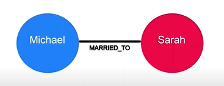
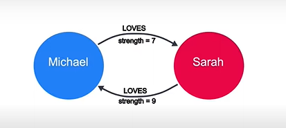

# Graph Thinking

## Module Overview

In this module, you will learn about:

- Leonhard Euler, the Swiss mathematician who founded the study of graph theory.
- Elements that make up a graph and how they are used to solve real-world problems.
- The structure of the graphs and how they are traversed.
- Common use-cases for graphs.

## Graph Elements

1. Nodes (Vertecies)
2. RelationShips (Edges)

## Graph Structure

- In an undirected graph relationships are considered to be **bidirectional (symetric)**

- In an directed graph relationships are **(asymetric)**

- In a weighted graph the relationships between nodes carry a value that represents a variety of measures for example cost, time, distance or priority.

## Shortest Path Algorithm

A basic shortest path algorithm would calculate the shortest distance between 2 nodes in the graph.

## Traversing a Graph

It means to path through a/multiple route(s) in a graph

## Graphs Are Everywhere

- E-commerce and real-time recommendations
- Investigative journalism
- Network dependencies graph
- Supply chain management system
