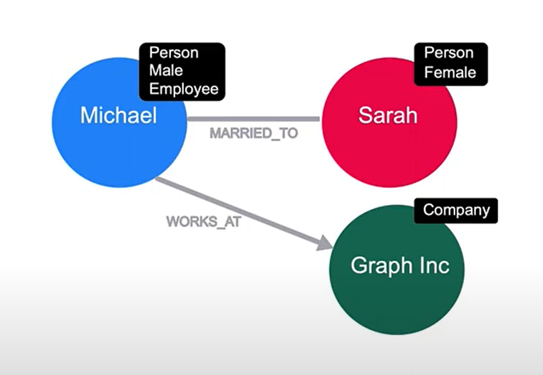
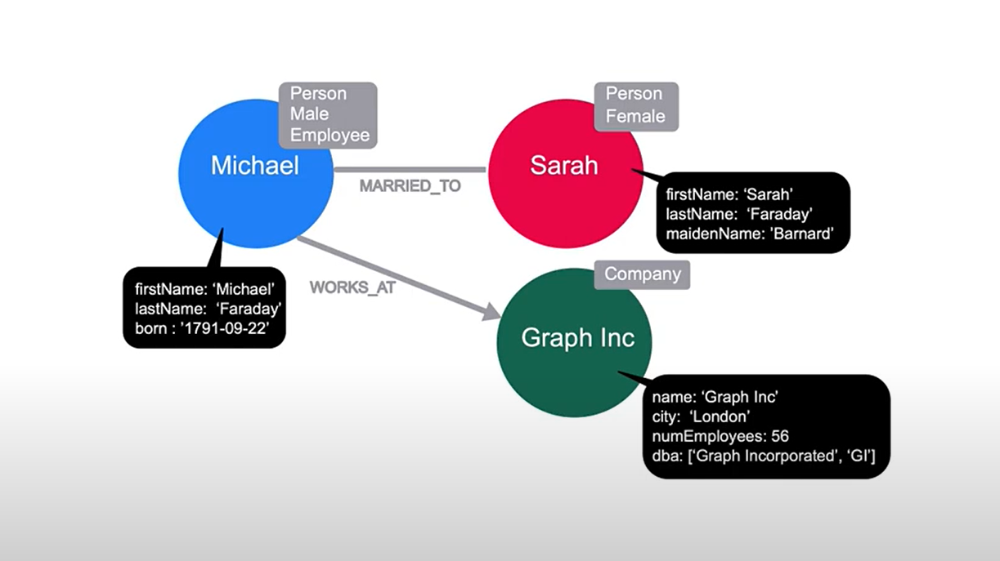

# Property Graphs

## Module Overview

In this module, you will learn about:

- The key elements a property graph and why they are useful.
- How Neo4j implements a native graph using index-free adjacency.
- Some of the ways that Relational and other NoSQL databases can be implemented in Neo4j.

## Lesson1: What is a Property Graph

### Labels

You can assign labels to nodes.
Each node can have 0 or more labels.

### Properties

Properties are key value pairs, and can be added or removed from a node as necessary.
Property values can be a single value or a list of values that conform to the cypher type system.

Properties can be placed on relationships as well.

### Directions

In neo4j all relationships must have a direction, but the relationship can be queried in either direction or ignored completely at query time.

All relationships in neo4j must have a type and a direction.
