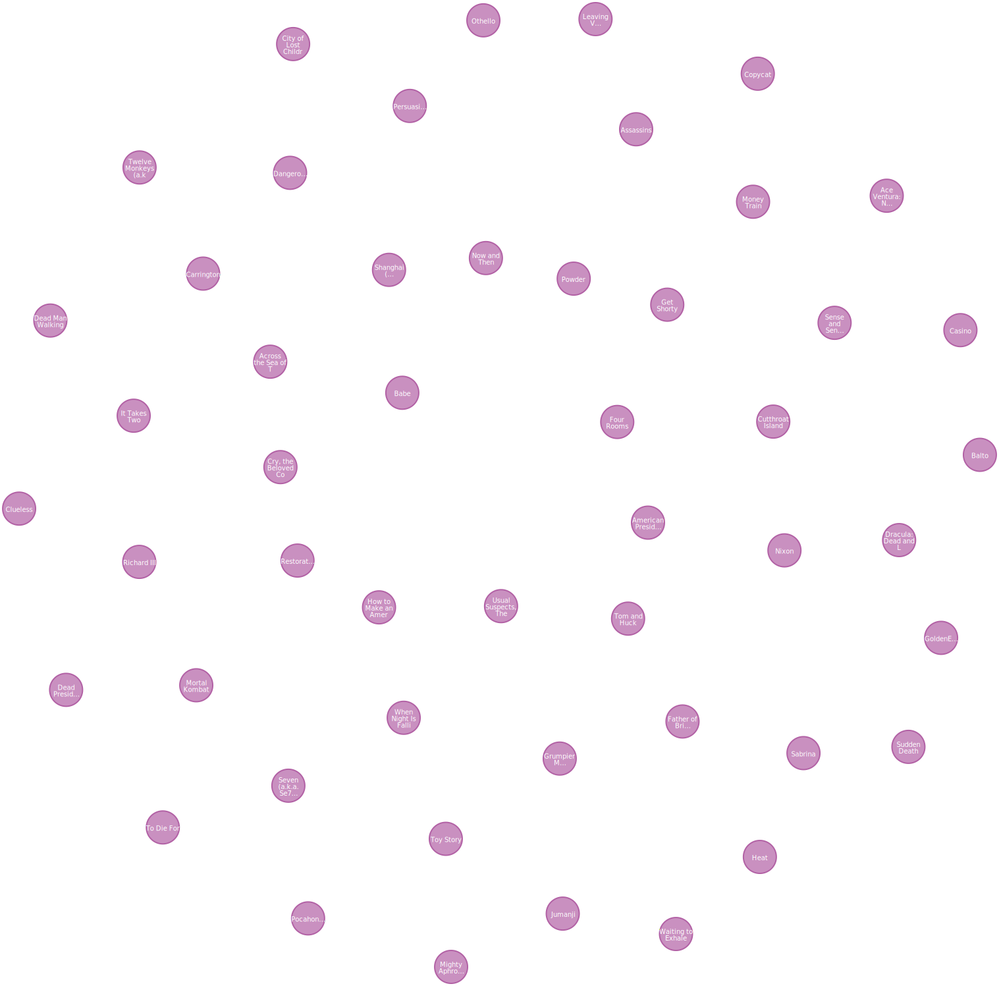
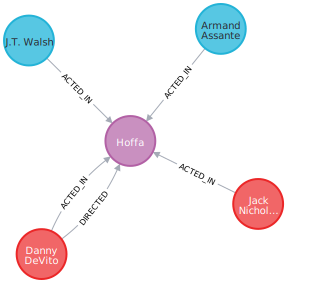

# Explore Neo4j

## Module Overview

In this module, you will:

- Explore a graph of movies.
- Use Cypher to query the graph.
- Learn the options for using Neo4j.
- Create your own Neo4j cloud instance on [Aura](https://console.neo4j.io/).

## Lesson: The Movie Graph

### Nodes

The graph contains nodes labeled `Movie` and `Person`.

Neo4j includes a query language called `Cypher` that allows you to query the graph.

Run the following Cypher query to return the first 50 `Movie` nodes in the graph:

```
MATCH (m:Movie) RETURN m LIMIT 50
```

You will see the `Movie` nodes returned as a graph.



Click on a node to see it’s properties. `Movie` nodes have properties like `title`, `released`, and `plot`.

You can filter the nodes returned by adding a condition to the query. For example, you can filter `Movie` nodes by the `title` property.

```
MATCH (m:Movie {title: 'Toy Story'}) RETURN m
```

### Relationships

The relationships between nodes describe how people are related to movies. For example, `Person` nodes have `ACTED_IN` and `DIRECTED` relationships with `Movie` nodes.

Run this Cypher query to return the `Movie` node 'Hoffa' and `Person` nodes with an `ACTED_IN` relationship to the movie:

```
MATCH (m:Movie {title: 'Hoffa'})<-[r:ACTED_IN]-(p:Person)
RETURN m, r, p
```



The movie 'Hoffa' is a `Movie` node with relationships to `Person` nodes who acted in and directed the movie.

> [!NOTE]
>
> The query doesn’t include the `DIRECTED` relationship, but it appears in the graph.
>
> Neo4j will also display other relationships between the returned nodes to give a complete view.

Modify the query to return the movie 'Top Gun'.

> [!TIP]
>
> The following query would return the movie node 'Top Gun' and the `Person` nodes with an `ACTED_IN` relationship to the movie. The query uses the `title` property of the `Movie` node to filter the nodes. The variable `m` represents the "Top Gun" `Movie` node, `r` is the `ACTED_IN` relationship, and `p` is the `Person` nodes.
>
> ```
> MATCH (m:Movie {title: 'Top Gun'})<-[r:ACTED_IN]-(p:Person) RETURN m, r, p
> ```

> [!TIP]
>
> View relationships
> You can double-click on nodes in the graph to expand their relationships with other nodes.

### Properties

Nodes have properties that describe them. For example, `Person` nodes have properties like `name` and `born`, `Movie` nodes have properties like `title` and `released`.

Relationships in Neo4j can also have properties, the `ACTED_IN` relationship has a `role` property, storing the person’s role in the movie.

Run the following Cypher to return the movie `title` and person’s `name` who acted in the movie "Top Gun":

```
MATCH (m:Movie {title: 'Top Gun'})<-[r:ACTED_IN]-(p:Person)
RETURN m.title, p.name
```

> [!NOTE]
>
> how the query returns the data as a table, rather than a graph, of the movie title and person’s name.

Modify the query to return the role property of the `ACTED_IN` relationship.

> [!NOTE]
>
> The query includes `r.role` in the return. The `r` variable represents the `ACTED_IN` relationship, and `r.role` returns the `role` property of the relationship.
>
> ```
> MATCH (m:Movie {title: 'Top Gun'})<-[r:ACTED_IN]-(p:Person)
> RETURN m.title, p.name, p.role
> ```

## Lesson: Get Neo4j

### Docker

Neo4j provides Docker images for both the Community and Enterprise editions.

The [Neo4j Docker documentation](https://neo4j.com/docs/operations-manual/current/docker/) provides instructions on how to run, configure, and deploy Neo4j in a Docker container.

## Course Summary

- Basic graph theory and the elements that make a graph
- Graph structures
- Common graph use cases
- Elements of a Neo4j graph database
- How Neo4j implements index-free-adjacency
- How to navigate a graph database
- How to get started with Neo4j
