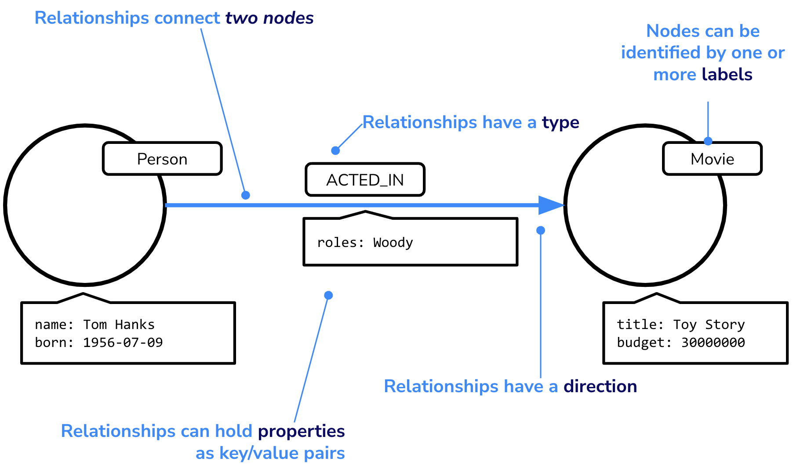
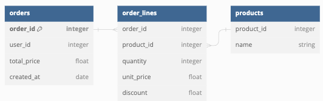
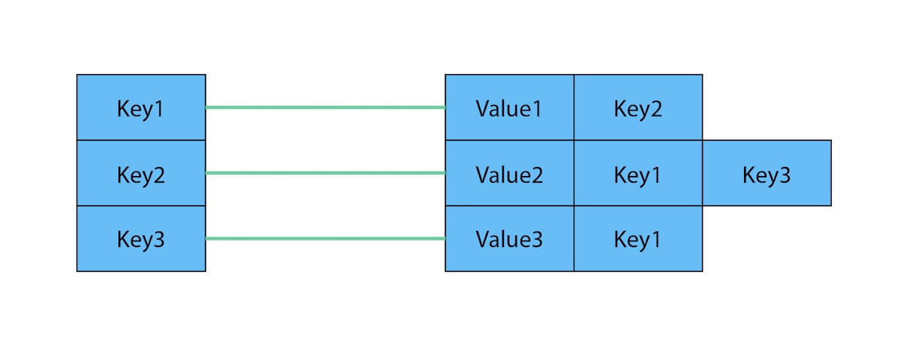

# Course Summary

In this course, you have learned:

- Basic graph theory and the elements that make a graph
- Graph structures
- Common graph use cases
- Elements of a Neo4j graph database
- How Neo4j implements index-free-adjacency
- How to navigate a graph database
- How to get started with Neo4j

Here is a summary of the course.

## What are graph databases?

- Graphs are mathematical structures consisting of **Edges** and **Vertices**
- In a Property Graph, we refer to these as **Nodes** and **Relationships**

## What are graph databases?

### Graphs are useful when:

- When the problem requires understanding the relationship between entities.
- When the problem involves a hierarchy.
- When the problem requires exploring relationships of varying or unknown depth.
- When the problem requires evaluating routes or paths through a network.

### Common Use Cases

- E-commerce platforms combine ratings, purchase history and browsing history to provide real-time recommendations.
- The ICIJ used Neo4j to explore and understand the network of global companies and identify persons with significant control.
- Many enterprises use Neo4j for planning, cost analysis, impact analysis and also to troubleshoot problems when a problem arises.

### What gives Neo4j its advantage?

- Neo4j is a native graph database designed specifically for graph traversal.
- Where Joins between tables are computed at read-time, this information is saved in a way that allows for quick pointer-chasing in memory
- Queries in Graph Databases are proportional to the amount of data touched during a query, not the size of data overall.

## What are Graph Databases?

### Graph Elements

> **Node**
>
> A node will commonly represent an individual record, for example, a thing or a fact.
>
> ---
>
> **Label**
>
> Nodes can have one or more labels. Labels provide a way to group nodes and also serve as a starting point for any database queries.
>
> ---
>
> **Relationship**
>
> A relationship connects two nodes. Each relationship has exactly one start and end node. A relationship will have a single a type.
>
> ---
>
> **Type**
>
> Relationships are identified by their type.
>
> ---
>
> **Property**
>
> Both nodes and relationships can contain properties. A property is a key/value pair.

### Example Graph

### Modeling Rules

- **Nodes typically represent things.** Examples of entities that could typically be represented as a node are: person, product, event, book or subway station.
- **Relationships are typically verbs.** We could use a relationship to represent a personal or professional connection (Person knows Person, Person married to Person), to state a fact (Person lives in Location, Person owns Car, Person rated Movie), or even to represent a hierarchy (Parent parent of Child, Software depends on Library).
- **Verbs can also be nodes.** A verb may be modeled as a node when one or more facts need to be associated with it. For example, you may want to group multiple product purchases through a single (:Order) node.

## Non-graph to Graph

### Relational DB to Graph

- Relational databases store data in tables, rows and columns
- Each row in each table becomes a node, and columns become properties
- Most table names can become labels
- Forget many-to-many relationships. These are modeled as relationships between two nodes.

### Document Store to Graph

- Data is organized into collections containing documents
- Collection group data, so their names can be used as labels
- Graphs do not support nested documents, but nested documents can become the structure in the graph
- Key-Value Store to Graph

### Key Value Model Key Value Model as a Graph

- Key-value stores are great for highly performant lookups on huge amounts of data
- When the values are interconnected, you have a graph
- Traversing a graph in a key-value store may involve writing complex code
