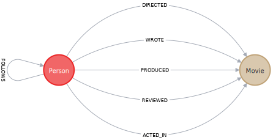

# Writing Data to Neo4j

In this module you will learn how to update the graph using Cypher and the Movies example dataset.

Summary:

- Use `MERGE` to create nodes in the graph.
- Use `MERGE` to create relationships in the graph.
- Create, update and remove properties for nodes and relationships in the graph.
- Perform conditional `MERGE` processing, depending on what is in the graph.
- Delete nodes and relationships from the graph.

## Domain model for this course

Again, here is the domain model and how it is represented in our graph:



## Creating nodes

We use the `MERGE` keyword to create a _pattern_ in the database.

After the `MERGE` keyword, we specify the pattern that we want to create. Usually this will be a single node or a relationship between two nodes.

Suppose we want to create a node to represent _Michael Caine_. Run this Cypher code to create the node.

> Cypher:
>
> ```
> MERGE (p:Person {name: 'Michael Caine'})
> ```

It creates a single node in the graph. Note that when you use `MERGE` to create a node, you must specify at least one property that will be the unique primary key for the node.

Verify that the node was created.

> Cypher:
>
> ```
> MATCH (p:Person {name: 'Michael Caine'})
> RETURN p
> ```

### Executing multiple Cypher clauses

We can also chain multiple `MERGE` clauses together within a single Cypher code block.

> Cypher:
>
> ```
> MERGE (p:Person {name: 'Katie Holmes'})
> MERGE (m:Movie {title: 'The Dark Knight'})
> RETURN p, m
> ```

This code creates two nodes, each with a primary key property. Because we have specified the variables _p_ and _m_, we can use them in the code to return the created nodes.

### Using CREATE instead of MERGE to create nodes

Cypher has a `CREATE` clause you can use for creating nodes. The benefit of using `CREATE` is that it does not look up the primary key before adding the node. You can use `CREATE` if you are sure your data is clean and you want greater speed during import. We use `MERGE` in this training because it eliminates duplication of nodes.
