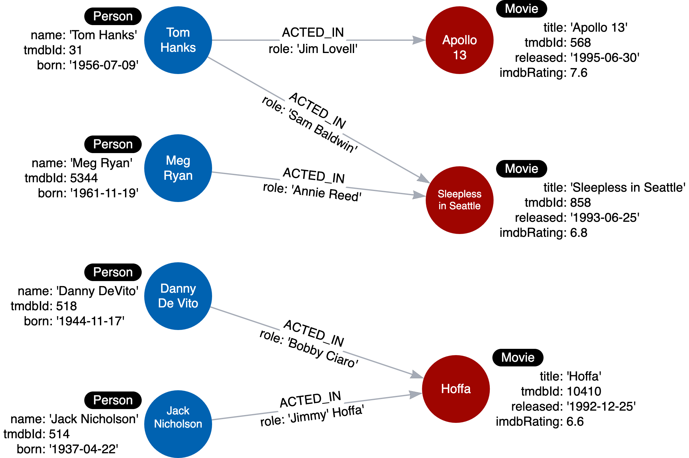

# Graph Data Modeling Fundamentals

## Module Overview

In this module, you will learn about:

- What graph data modeling is.
- How domain knowledge is important for modeling.
- The difference between a graph data model and an instance model.

## What is Graph Data Modeling?

### Why model?

If you use a Neo4j graph to support part or all of your application, you must collaboratively work with your stakeholders to design a graph that will:

- Answer the key use cases for the application.
- Provide the best Cypher statement performance for the key use cases.

### Components of a Neo4j graph

The Neo4j components that are used to define the graph data model are:

- Nodes
- Labels
- Relationships
- Properties

### Data modeling process

Here are the steps to create a graph data model:

1. Understand the domain and define specific use cases (questions) for the application.
2. Develop the initial graph data model:
   - Model the nodes (entities).
   - Model the relationships between nodes.
3. Test the use cases against the initial data model.
4. Create the graph (instance model) with test data using Cypher.
5. Test the use cases, including performance against the graph.
6. Refactor (improve) the graph data model due to a change in the key use cases or for performance reasons.
7. Implement the refactoring on the graph and retest using Cypher.

Graph data modeling is an iterative process. Your initial graph data model is a starting point, but as you learn more about the use cases or if the use cases change, the initial graph data model will need to change. In addition, you may find that especially when the graph scales, you will need to modify the graph **(refactor)** to achieve the best performance for your key use cases.

Refactoring is **very common** in the development process. A Neo4j graph has an optional schema which is quite flexible, unlike the schema in an RDBMS. A Cypher developer can easily modify the graph to represent an improved data model.

## The Domain

### Understanding the domain for your application

Before you begin the data modeling process you must:

- Identify the stakeholders and developers of the application.
- With the stakeholders and developers:
  - Describe the application in detail.
  - Identify the users of the application (people, systems).
  - Agree upon the use cases for the application.
  - Rank the importance of the use cases.

### Movie domain

In the course, Neo4j Fundamentals, you were introduced to a "starter" movie graph.

The domain includes movies, people who acted or directed movies, and users who rated movies. What makes this domain interesting are the connections or relationships between nodes in the graph.

### Use cases

Most use cases for an application can be enumerated by a comprehensive list of questions. The use cases help to define how the application will behave at runtime.

Here are the use cases you will be working with to develop the initial graph data model:

Here are the use cases you will be working with to develop the initial graph data model:

- What people acted in a movie?
- What person directed a movie?
- What movies did a person act in?
- How many users rated a movie?
- Who was the youngest person to act in a movie?
- What role did a person play in a movie?
- What is the highest rated movie in a particular year according to imDB?
- What drama movies did an actor act in?
- What users gave a movie a rating of 5?

In our domain, we want to differentiate a person who acted in or directed a movie and a user or reviewer who rated a movie. We have much more information about people such as their birth date, their tmdbId etc. Users who rated movies will just be named or identified.

## Purpose of the Model

### Types of Models

When performing the graph data modeling process for an application, you will need at least two types of models:

- Data model
- Instance model

### Data Model

The data model describes the labels, relationships, and properties for the graph. It does not have specific data that will be created in the graph.

Here is an example of a data model:

There is nothing that uniquely identifies a node with a given label. A graph data model, however is important because it defines the names that will be used for labels, relationship types, and properties when the graph is created and used by the application.

### Style guidelines for modeling

As you begin the graph data modeling process, it is important that you agree upon how labels, relationship types, and property keys are named. Labels, relationship types, and property keys are case-sensitive, unlike Cypher keywords which are case-insensitive.

- A Neo4j best practice is to use the following when you name the elements of the graph, but you are free to use any convention for your application.
- A label is a single identifier that begins with a capital letter and can be PascalCase.
  - Examples: Person, Company, GitHubRepo
- A relationship type is a single identifier that is in all capital letters with the underscore character.
  - Examples: FOLLOWS, MARRIED_TO
- A property key for a node or a relationship is a single identifier that begins with a lower-case letter and can be camelCase.
  - Examples: deptId, firstName

> [!NOTE]
> Property key names need not be unique. For example, a Person node and a Movie node, each can have the property key of tmdbId.

### Instance Model

An important part of the graph data modeling process is to test the model against the use cases. To do this, you need to have a set of sample data that you can use to see if the use cases can be answered with the model.

Here is an example of an instance model:

In this instance model, we have created some instances of Person and Movie nodes, as well as their relationships. Having this type of instance model will help us to test our use cases.
