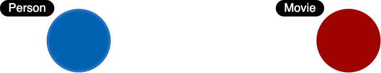
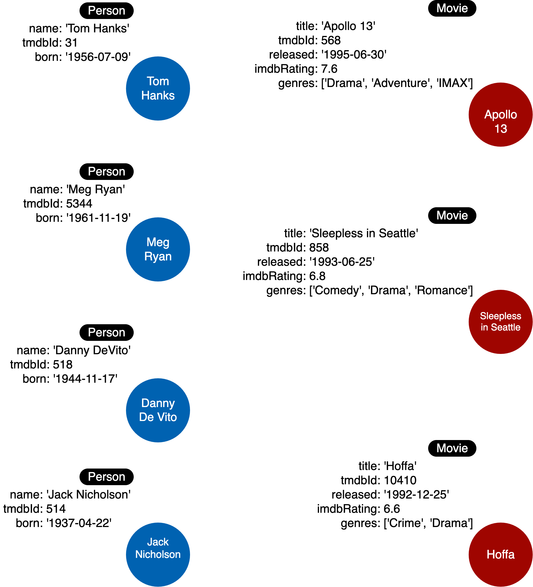

# Modeling Nodes

## Module Overview

In this module, you will learn about:

- Identifying the entities from your use cases.
- Creating nodes in the graph in support of the data model.

## Defining labels

Entities are the dominant nouns in your application use cases:

1. What **ingredients** are used in a **recipe**?
2. Who is married to this **person**?

The entities of your use cases will be the labeled nodes in the graph data model.

In the Movie domain, we use the **nouns** in our use cases to define the labels, for example:

1. What people acted in a movie?
2. What person directed a movie?
3. What movies did a person act in?

Here are some of the labeled nodes that we will start with.

Notice here that we use PascalCase for the names for labels.

### Node properties

Node properties are used to:

- Uniquely identify a node.
- Answer specific details of the use cases for the application.
- Return data.

For example, in a Cypher statement, properties are used to:

- Anchor (where to begin the query).
  - `MATCH (p:Person {name: 'Tom Hanks'})-[:ACTED_IN]-(m:Movie) RETURN m`
- Traverse the graph (navigation).
  - `MATCH (p:Person)-[:ACTED_IN]-(m:Movie {title: 'Apollo 13'})-[:RATED]-(u:User) RETURN p,u`
- Return data from the query.
  - `MATCH (p:Person {name: 'Tom Hanks'})-[:ACTED_IN]-(m:Movie) RETURN m.title, m.released`

### Unique identifiers in the Movie graph

In the Movie graph, we use the following properties to uniquely identify our nodes:

- Person.tmdbId
- Movie.tmdbId

### Properties for nodes

In addition to the _tmdbId_ that is used to uniquely identify a node, we must revisit the use cases to determine the types of data a node must hold.

Here is a list of our use cases specific to Person and Movie nodes that we will focus on. These use cases inform us about the data we need in Movie and Person nodes.

| Use case                                                                   | Steps required                                                                                                                      |
| -------------------------------------------------------------------------- | ----------------------------------------------------------------------------------------------------------------------------------- |
| 1: What people acted in a movie?                                           | - Retrieve a movie by its **title**. - Return the **names** of the actors.                                                       |
| 2: What person directed a movie?                                           | - Retrieve a movie by its **title**. - Return the **name** of the director.                                                      |
| 3: What movies did a person act in?                                        | - Retrieve a person by their **name**. - Return the **titles** of the movies.                                                    |
| 5: Who was the youngest person to act in a movie?                          | - Retrieve a movie by its **title**. - Evaluate the **ages** of the actors. - Return the **name** of the actor.               |
| 7: What is the highest rated movie in a particular year according to IMDb? | - Retrieve all movies **released** in a particular year. - Evaluate the **IMDb ratings**. - Return the movie **title**.       |
| 8: What drama movies did an actor act in?                                  | - Retrieve the actor by **name**. - Evaluate the **genres** for the movies the actor acted in. - Return the movie **titles**. |

Given the details of the steps of these use cases, here are the properties we will define for the _Movie_ nodes:

- Movie.title (string)
- Movie.released (date)
- Movie.imdbRating (decimal between 0-10)
- Movie.genres (list of strings)

Here are the properties we will define for the Person nodes:

- Person.name (string)
- Person.born (date)
- Person.died (date)

> [!NOTE]
> The died property will be optional.

Here is the initial data model:

And here is the initial instance model you will be creating:

