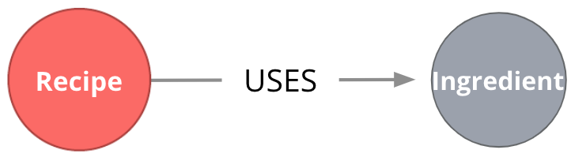
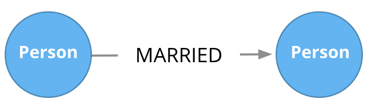
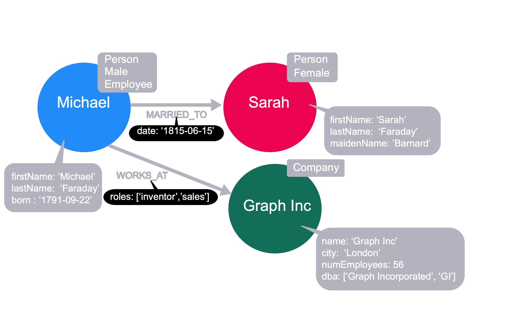

# Modeling Relationships

## Module Overview

In this module, you will learn about:

- Identifying the relationships from your use cases.
- Creating relationships in the graph to support the data model.

## Relationships are connections between entities

Connections are the **verbs** in your use cases:

- What ingredients are **used** in a recipe?
- Who is **married** to this person?

At a glance, connections are straightforward things, but their micro- and macro-design are arguably the most critical factors in graph performance. Using “connections are verbs” is a fine shorthand to get started, but there are other important considerations that you will learn about later in this course.

### Naming relationships

Choosing good names (types) for the relationships in the graph is important. Relationship types need to be something that is intuitive to stakeholders and developers alike. Relationship types cannot be confused with an entity name.

So in our example use cases, we could define these relationship types:

- USES
- MARRIED

> [!NOTE]
> here that we use the Neo4j best practice of all capital letters/underscore characters for the name of the relationship.

### Relationship direction

When you create a relationship in Neo4j, a direction must either be specified explicitly or inferred by the left-to-right direction in the pattern specified. At runtime, during a query, direction is typically not required.

In our example use cases shown above, the **USES** relationship must be created to go from a Recipe node to an Ingredient node.

The **MARRIED** relationship could be created to start in either node since this type of relationship is symmetric.

> [!NOTE]
> A relationship is typically between 2 different nodes, but it can also be to the same node.

### Fanout

Here, we have entities (Person, Residence) represented not as a single node, but as a network or linked nodes.

This is an extreme example of fanout, and is almost certainly overkill for any real-life solution, but some amount of fanout can be very useful.

For example, splitting last names onto separate nodes helps answer the question, “Who has the last name Scott?”. Similarly, having cities as separate nodes assists with the question, “Who lives in the same city as Patrick Scott?”.

The main risk about fanout is that it can lead to very dense nodes, or supernodes. These are nodes that have hundreds of thousands of incoming or outgoing relationships Supernodes need to be handled carefully.

### Properties for relationships

Properties for a relationship are used to enrich how two nodes are related. When you define a property for a relationship, it is because your use cases ask a specific question about how two nodes are related, not just that they are related.

For example, we saw in the _Neo4j_ Fundamentals course that properties can be added to a relationship to further describe it.

Here we see that we have a date property on the _MARRIED_ relationship to further describe the relationship between Michael and Sarah. Additionally, we have a _roles_ property on the _WORKS_AT_ relationship to describe the roles that Michael has or had when he worked at Graph Inc.

These properties are specific to the relationship between two nodes.
