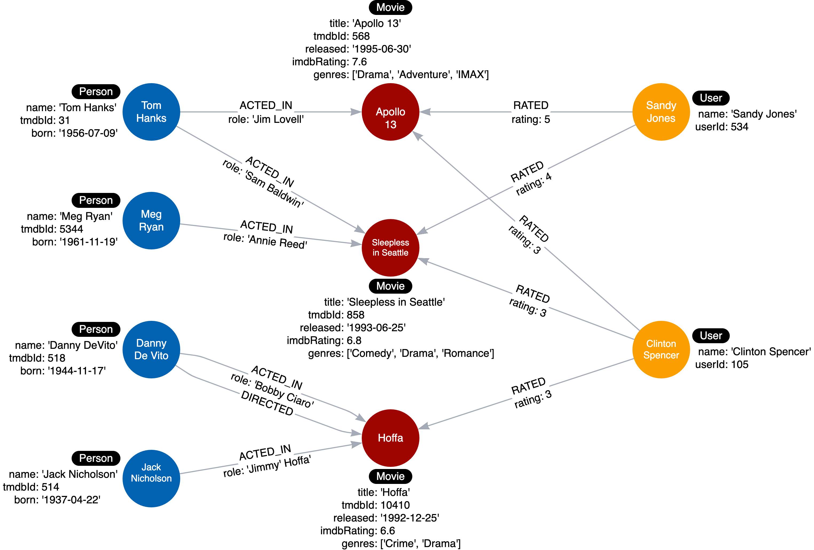

# Testing the Model

## Module Overview

In this module, you will test that the graph can be used to test the use cases of the model.

## Testing

### Why Test?

Thus far you have seen that you design the data model on paper, whiteboard, or with a tool like [Arrows app](https://arrows.app/). You use the use cases to design the data model that includes labels for nodes, relationship types and direction, and properties for the nodes and relationships.

You have also populated the graph to implement the data model with a small set of test data. To ensure that the graph can satisfy every use case, you must test the use cases against the graph.

### Testing the data model

Here is the instance model that should now be in our graph:



In the next challenge you will test each use case against the graph by executing Cypher queries.

Your testing will be to execute Cypher code against the instance model to verify that graph and the query support the use case.

For example, with our first use case:

#### Use case #1: What people acted in a movie?

You will execute this query where you specify the title of the movie:

> Cypher
>
> ```cypher
> MATCH (p:Person)-[:ACTED_IN]-(m:Movie)
> WHERE m.title = 'Sleepless in Seattle'
> RETURN p.name AS Actor
> ```

In the description of the use cases, you may even specify what the expected result should be.

### More testing?

As you go through the use cases, you may think of more data that you want to add to the graph to round out the testing.

The Cypher code used to test the use cases needs to be carefully reviewed for correctness. In addition, you must understand that if and when the graph is refactored (next module), the Cypher code for these use cases may need to be modified to improve performance.

The basic testing to ensure that the use cases can be answered by the data model is the first step of testing.

A really important factor with testing the graph is **scalability**. How will these queries perform if the graph has millions of nodes or relationships? This is where you need to work with the Cypher developers to test the performance of the queries when the graph grows.
