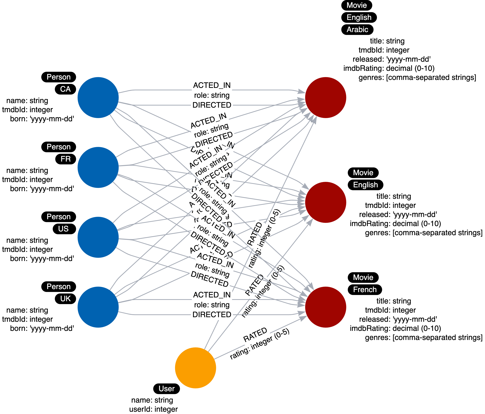
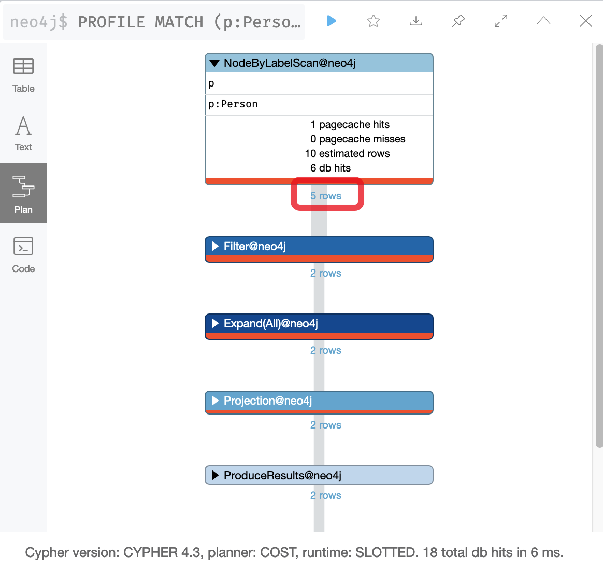

# Refactoring the Graph

## Module Overview

In this module, you will learn about:

- Why we refactor a graph data model and graph.
- Adding labels to the data model.

## Refactoring

### Why Refactor?

Refactoring is the process of changing the data model **and** the graph.

There are three reasons why you would refactor:

- The graph as modeled does not answer all of the use cases.
- A new use case has come up that you must account for in your data model.
- The Cypher for the use cases does not perform optimally, especially when the graph scales

### Steps for refactoring

To refactor a graph data model and a graph, you must:

1. Design the new data model.

2. Write Cypher code to transform the existing graph to implement the new data model.

3. Retest all use cases, possibly with updated Cypher code.

## Labels in the Graph

### Labels at runtime

Node labels serve as an anchor point for a query. By specifying a label, we are specifying a subset of one or more nodes with which to start a query. Using a label helps to reduce the amount of data that is retrieved.

For example:

`MATCH (n) RETURN n returns all nodes in the graph.`

`MATCH (n:Person) RETURN n` returns all _Person_ nodes in the graph.

Your goal in modeling should be to reduce the size of the graph that is touched by a query.

In Cypher, you can produce a query plan that shows what operations occur during the query. This figure shows a query plan by the number of db hits for the query to retrieve all _Person_ nodes:


If _Person_ nodes also had a label which is the country that a person is from, then you could used this Cypher code to retrieve all people from the US:

`MATCH (n:US) RETURN n` returns all US nodes in the graph which happen to be Person nodes.

But having a label that is specific like this might be overkill, especially if the query could be:

`MATCH (n:Person) WHERE n.country = 'US' RETURN n`

Cypher, you cannot parameterize labels so keeping the country as a property makes the Cypher code more flexible.

But if you have a strong use case for having multiple labels for a node, you should do so.

### Do not overuse labels

You should use labels wisely in your data model. They should be used if it will help with most of your use cases. A best practice is to limit the number of labels for a node to 4.

Here is an example of overuse of labels in the data model:



Here we see _Person_ nodes that have a label representing the country that a _Person_ is from like we described earlier.

In addition, we see multiple labels for _Movie_ nodes. The label represents the languages available for a movie.

This is another similar scenario where you must decide if an important use case is related to the language of a movie. Again if the use of a property for a node will suffice, then it is best to not have the label.

### New use case

Here is an example where adding a label will help our queries at runtime.

What if we added a new use case:

#### Use case #10: What actors were born before 1950?

Here is the Cypher statement to test this use case:

> Cypher
>
> ```cypher
> MATCH (p:Person)-[:ACTED_IN]-()
> WHERE p.born < '1950'
> RETURN p.name
> ```

Here is what this Cypher statement does:

1. A node by label scan to retrieve all Person nodes.

2. Tests the born property for the nodes retrieved to filter them.

3. Determines which of these filtered nodes have the outgoing ACTED_IN relationship.

4. Returns the name property values.

### Profiling a query

You can use the `PROFILE` keyword to see the performance for a query.

> Cypher
>
> ```cypher
> PROFILE MATCH (p:Person)-[:ACTED_IN]-()
> WHERE p.born < '1950'
> RETURN p.name
> ```

This is the result of the profile:



Because the cache is automatically populated, it is sometimes hard to measure performance with a small dataset. That is, db hits and elapsed time may not be comparable. What you can see, however, is the number of rows that are retrieved in the query and this number can be compared.

In the first step of this query, we see that 5 rows are returned. You can imagine that if this were a fully-loaded graph with millions of nodes, in step 1, it would need to retrieve a lot of Person nodes, some of which are not actors. One way that you can optimize this retrieval is to change the data model to include an Actor label for a Person node.

### Refactoring the model

If we refactor, the initial node by label scan would only retrieve the Actor nodes.

Here is the refactored instance model we will create in the graph:


### Refactor the graph

With Cypher, you can easily transform the graph. With this code, that you will execute in the next Challenge, we find all _Person_ nodes that have an _ACTED_IN_ relationship. We then set a label for the node.

> Cypher
>
> ```cypher
> MATCH (p:Person)
> WHERE exists ((p)-[:ACTED_IN]-())
> SET p:Actor
> ```
