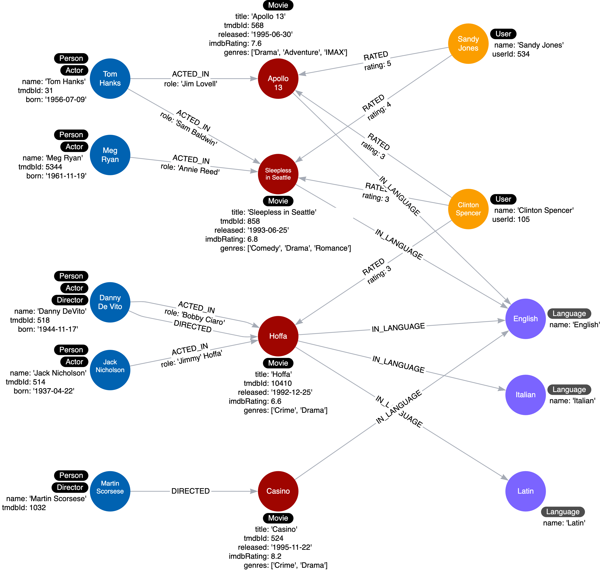
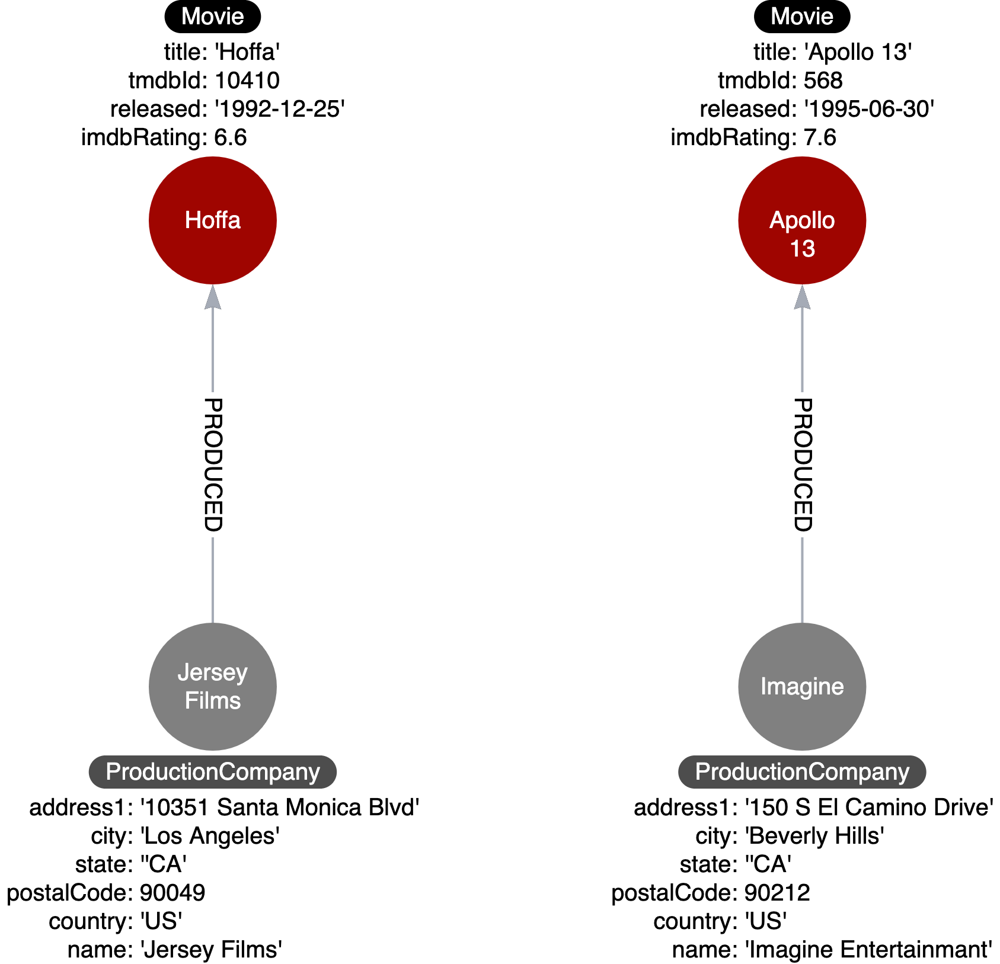

# Eliminating Duplicate Data

## Module Overview

In this module, you will learn about:

- Creating nodes from properties where property values are duplicated in the graph.
- Eliminating complex data in nodes that is expensive to query.

## Eliminating Duplicate Data

### Duplicate data

You should take care to avoid duplicating data in your graph. Where some databases require a form of denormalization to improve the speed of a set of queries, this is not always the case with a graph database. De-duplicating data gives you the added benefit of allowing you to query through a node - for example, finding other customers who have purchased a particular product, or finding similar movies based on the rating of other users.

In addition, duplicating data in the graph increases the size of the graph and the amount of data that may need to be retrieved for a query.

## Refactoring Duplicate Data

### Querying duplicate data

Here is our current instance model where each Movie node has a languages property:


For our latest use case:

#### Use case #11: What movies are available in a particular language?

This query finds all movies in _Italian_:

> Cypher
>
> ```cypher
> MATCH (m:Movie)
> WHERE 'Italian' IN m.languages
> RETURN m.title
> ```

What this query does is retrieve all Movie nodes and then test whether the languages property contains _Italian_. There are two issues with the data model, especially if the graph scales:

- The name of the language is duplicated in many Movie nodes.
- In order to perform the query, all Movie nodes must be retrieved.

A solution here is to model properties as nodes.

### Refactor properties as nodes

Here are the steps we use to refactor:

1. We take the property values for each Movie node and create a Language node.

2. Then we create the IN_LANGUAGE relationship between that Movie node and the Language node.

3. Finally, we remove the languages property from the Movie node.

This is the code to refactor the graph to turn the property values into nodes:

> Cypher
>
> ```cypher
> MATCH (m:Movie)
> UNWIND m.languages AS language
> WITH  language, collect(m) AS movies
> MERGE (l:Language {name:language})
> WITH l, movies
> UNWIND movies AS m
> WITH l,m
> MERGE (m)-[:IN_LANGUAGE]->(l);
> MATCH (m:Movie)
> SET m.languages = null
> ```

This code iterates through all _Movie_ nodes and creates a Language node for each language it finds and then creates the relationship between the _Movie_ node and _Language_ node using the _IN_LANGUAGE_ relationship. It uses the Cypher `UNWIND` clause to separate each element of the _languages_ property list into a separate row value that is processed later in the query.



There will only be one node with the language value of English and we remove the languages property from all Movie nodes. This eliminates a lot of duplication in the graph.

## Eliminating Complex Data in Nodes

### Example: Complex data

Since nodes are used to store data about specific entities, you may have initially modeled, for example, a _Production_ node to contain the details of the address for the production company.



Storing complex data in the nodes like this may not be beneficial for a couple of reasons:

1. Duplicate data. Many nodes may have production companies in a particular location and the data is repeated in many nodes.

2. Queries related to the information in the nodes require that all nodes be retrieved.

### Refactoring complex data

If there is a high amount of duplicate data in the nodes or if key questions of your use cases would perform better if all nodes need not be retrieved to get at the complex data, then you might consider refactoring the graph as shown here.


In this refactoring, if there are queries that need to filter production companies by their state, then it will be faster to query based upon the State.name value, rather than evaluating all of the state properties for the Production nodes.

How you refactor your graph to handle complex data will depend upon the performance of the queries when your graph scales.
