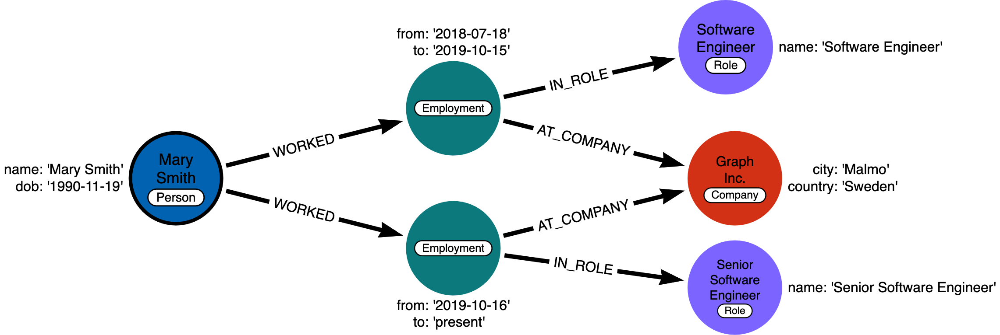

# Adding Intermediate Nodes

## Module Overview

In this module, you will learn about:

- Why intermediate nodes are necessary.
- Creating an intermediate node.

## Intermediate Nodes

You sometimes find cases where you need to connect more data to a relationship than can be fully captured in the properties. In other words, you want a relationship that connects more than two nodes. Mathematics allows this, with the concept of a hyperedge. This is impossible in Neo4j, but a solution is to create intermediate nodes.

You create intermediate nodes when you need to:

- Connect more than two nodes in a single context.
  - Hyperedges (n-ary relationships)
- Relate something to a relationship.
- Share data in the graph between entities.

These three use cases are used to make the graphs relationships more meaningful and sharable between nodes.

### Example: Need for intermediate nodes

Here is an example instance model:

Here we have the _WORKS_AT_ hyperedge that has the from and to properties, but we need to associate the role with this period of work. In Neo4j, there is no way to create a relationship that connects a relationship to a third node. Neo4j relationships can only connect two nodes.

#### Adding an intermediate node to the model

The solution is to replace the hyperedge with a connection point node. Since nodes are connection points, you simply create a node in the middle of the hyperedge.

In this example, we replace the WORKS_AT hyperedge with an Employment intermediate node. This provides a connection point that allows us to connect any amount of information to Mary’s term of employment at Acme. In addition, Person nodes can have a shared Role or Company, and allow us to very easily trace either the full details of a single person’s career, or the overlap between different individuals.

### Example: Intermediate nodes for sharing data

In many cases relationships can share data which enables your graph to contain less duplicate data.

Here is what the graph looks like before we refactor it:

Intermediate nodes also allow you to deduplicate information. We mentioned a similar principle when we discussed fanout where splitting a property onto its own node allows you to reference it via a relationship instead of a repeated property.

In this case, the Email intermediate node spares us having to repeat the email content on every single relationship.

### Intermediate nodes for the movie graph?

Here is our current instance model for the movie graph we have been working with:

In looking at the data, we can see that if we were able to perform further analysis of the roles property of the ACTED_IN relationships, we would be able to answer questions about how the same role is used in multiple movies. Furthermore, we might want to analyze how different roles interact with each other, even across different movies.
